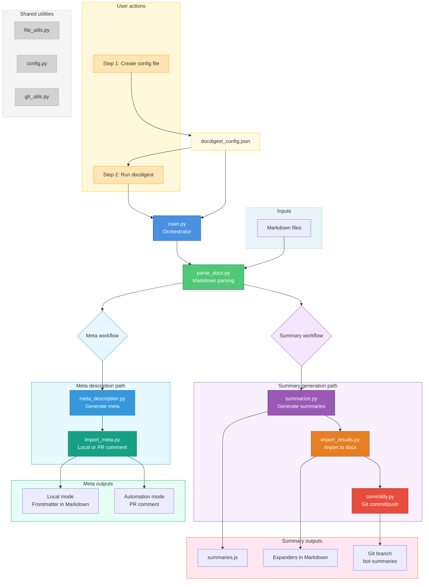

## Design and structure of `docdigest`

The tooling to generate AI summaries for the docs has the following stages, each corresponding to a Python module in this package.

1. 📖 Parse documentation
2. 🤖 Generate summaries (writes summaries.js)
   1. 🧮 Parallel option to dry-run (optional, exits early)
3. 📝 Update markdown imports (modifies .md files)
4. 📦 Commit changes (individual commits per summary)

### Package structure

```
docdigest
├── __init__.py
├── commitify.py
├── config.py
├── file_utils.py
├── git_utils.py
├── import_results.py
├── main.py
├── parse_docs.py
└── summarize.py
```

NOTE: If you update or add a module, also update `pyproject.toml` for GHA installation.

### Diagram of components


